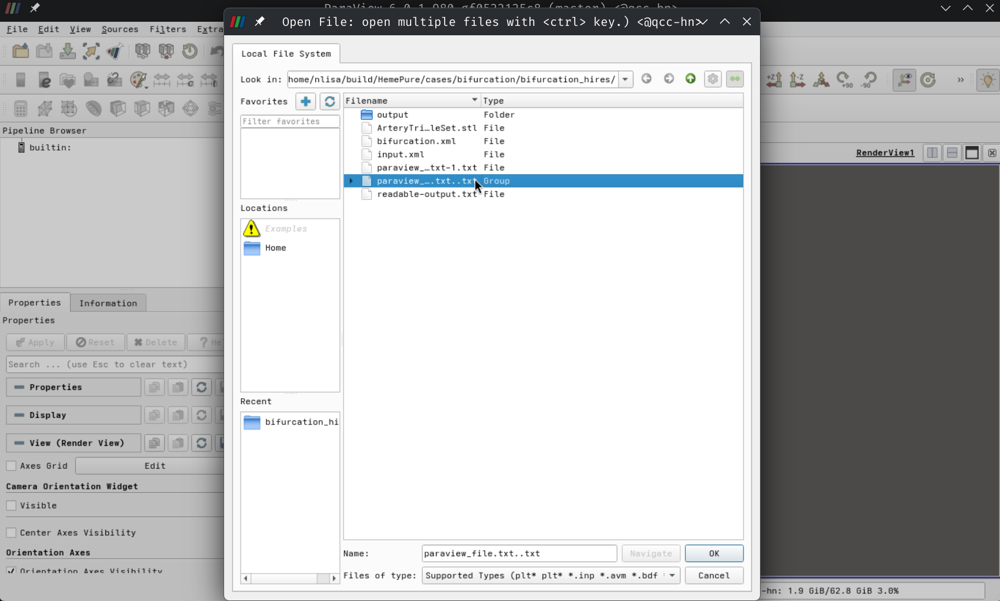
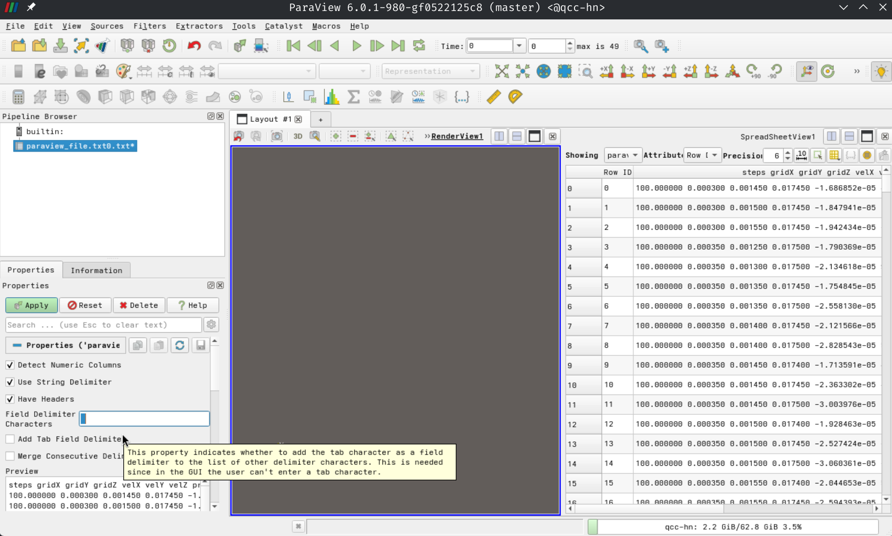
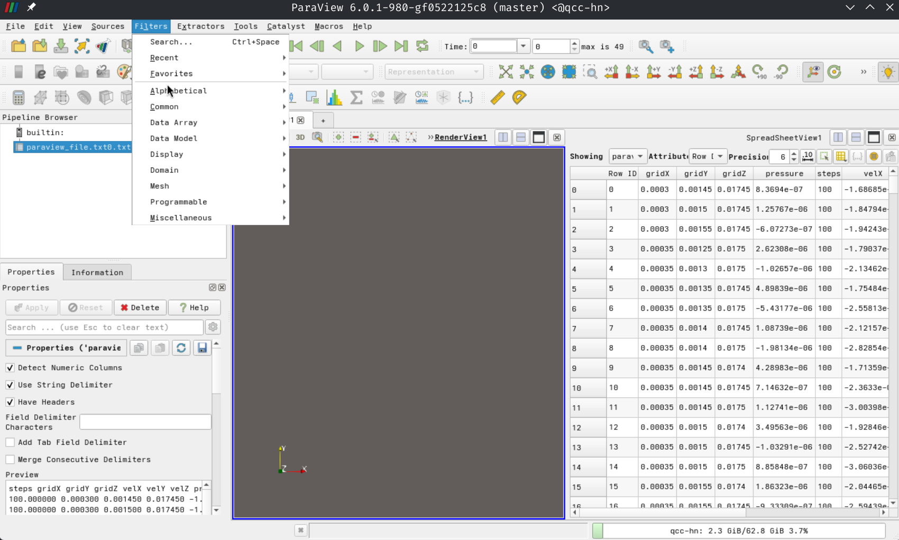
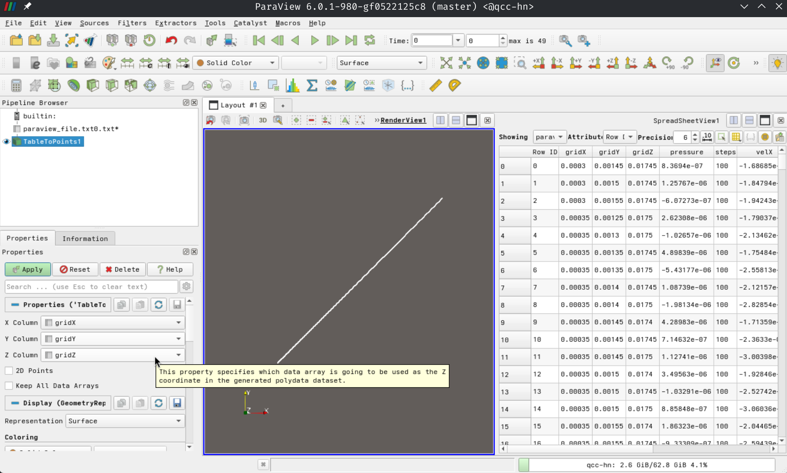
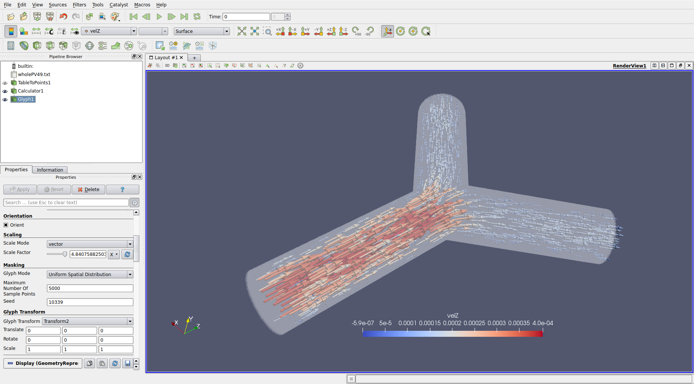

HemePure
=========

HemePure is a piece of software that initially started development at the University College London and was initially based on the [lattice Boltzmann method](https://github.com/hemelb-codes/hemelb) to simulate macroscopic blood fluid flow in complex 3D vascular geometries of blood vessel networks. **Optionally** refer to the following publications for more information on the origins and performance analysis of the software:
* M.D. Mazzeo & P.V. Coveney, "HemeLB: A high performance parallel lattice-Boltzmann code for large scale fluid flow in complex geometries", Comput. Phys. Commun. (2008) https://doi.org/10.1016/j.cpc.2008.02.013.
* D. Groen, J. Hetherington, H.B. Carver, R.W. Nash, M.O. Bernabeu, "Analysing and modelling the performance of the HemeLB lattice-Boltzmann simulation environment", J. Comput. Sci. (2013) https://doi.org/10.1016/j.jocs.2013.03.002.

More recent publications, and how the original source code evolved from HemeLB can be found here, [HemePure](https://github.com/hemelb-codes/HemePure).

# Installation Instructions

The main lattice-Boltzman solver is written in C++ and its parallelisation is implemented via MPI. Additionally the application relies on several external libraries for tasks as XML processing, domain decomposition, unit testing, and real time visualization.

## Obtaining the source code

A copy of the source code can be obtained from GitHub:
```
git clone https://github.com/UCL-CCS/HemePure.git
```

## Dependencies

Install or build your choice of `C/C++` and `MPI` compiler implementations, `Boost`, `CMake`, `CPPUnit`, `CTemplate`, `TinyXML` and `ZLib`. Additionally, building **HemePure** also requires the following dependencies which are provided with and can be built together with source:
* [GKlib](https://github.com/KarypisLab/GKlib),
* [METIS](https://github.com/KarypisLab/METIS) and
* [ParMETIS](https://github.com/KarypisLab/ParMETIS).

> [!TIP]
> You may make use of GKlib, METIS and ParMETIS libraries that you build and compile yourself from [Prof Karypis' GitHub repo](https://github.com/KarypisLab/) or any other reputable source of the ParMETIS source code.

## Building HemePure

Descend into the `HemePure` folder from the GitHub repository you'd cloned earlier:
```
cd <PATH-TO-BUILD>/HemePure
```

Examine the `FullBuild.sh` file, which can refer back to for guidance on building the dependencies *(optionally)* and source for `HemePure`. Follow the instructions for a typical `SRCBuild()`, i.e.:
```
cd src
FOLDER=<sensible_name>

# Uncomment to clean build options
# rm -rf $FOLDER

mkdir $FOLDER
cd $FOLDER
cmake -DCMAKE_C_COMPILER=${CC} -DCMAKE_CXX_COMPILER=${CXX} -DHEMELB_USE_GMYPLUS=OFF -DHEMELB_USE_MPI_WIN=OFF -DHEMELB_USE_SSE3=ON -DHEMELB_USE_AVX2=ON ..

make -j$(nprocs)
```

> [!TIP]
> Should your CPU architecture support it, consider additionally turning on AXV512 vectorization. You must ensure that the variables `<METIS_DIR>` and `<PARMETIS_DIR>` exist (i.e. have been exported) in your environment.

Should your application successfully compile, link and build, you will have `hemepure` binary executable in your build directory.

# Benchmark: Bifurcation

From the main `HemePure` folder from the GitHub repository you'd cloned earlier, navigate to the high resolution bifurcation example:
```
cd examples/bifurcation/bifurcation_hires/
```

## Examining the input XML file
```
# Your choice of text editor nano / vim
vim input.xml
```
> [!CAUTION]
> You do not need to edit any variables in this file yet!

This file details the various components used to conduct the simulation:
### Simulation information
* Time step length `<step_length>`
* Total number of time steps `<steps>` **NB: This is the only parameter you will be changing after you have completed your visualization**
* Type of stress / Lattice spacing / voxel size
* Simulation domain geometry
* Initial conditions (pressure)

### Boundary conditions

Simulations have all of their **input** and **output** locations independently parameterized.

> [!NOTE]
> There is a single **input** section and two **output** sections.

### Simulation outputs

Finally the simulation output information is recorded for further analysis and visualization, where the velocity and pressure of lattice sites are stored in:
* `whole.dat`: all lattice sites over entire domain volume,
* `inlet.dat`: surface lattice sites of the inlet.

## Running the Bifurcation example

Launch the simulation using `mpirun`:
```
mpirun -N <NUM_PROCESSES> ../../../src/build_PV/hemepure -in input.xml -out <OUTPUT_DIR>
```

You are required to complete all time steps of the simulation and to your objective is to try and minimize the total simulation runtime. Submit your `report.txt` and `report.xml` files from your <OUTPUT_DIR>.


# Benchmark Visualization

You will now visually inspect the evolution of the flow within the simulation.

## Analysis of Results

Use the tool provided with the HemePure GitHub repository `hemeXtract`, convert the compressed output data files, into a human readable format compatible with [ParaView](https://www.paraview.org/).

```
# make the tool executable
chmod +x ../../hemeXtract
../../hemeXtract -X output/Extracted/whole.dat > readable-output.txt
```

> [!IMPORTANT]
> Decide if you will be running ParaView on your personal laptop or on one of your competition nodes. ParaView can specifically be run in a Client-Server mode (where you would need to install the same version on your laptop and compute node), alternatively, instructions will be provided to run it exclusively over an X11 SSH tunnel.

Use the provided here [./paraviewProcessing.sh] shell script to prepare your `readable-output` file for processing within ParaView.
```
# Either copy your readable-output.txt file to your laptop, or copy the script into your <OUTPUT_DIR>
chmod +x paraviewProcessing.sh
./paraviewProcessing.sh readable-output.txt paraview_file
```

## Install ParaView

Follow the instructions [here](https://gitlab.kitware.com/paraview/paraview) to build, paying careful attention to dependencies.

After configuring the dependencies for your specific environment, retrieve a copy of the source from GitHub and build it using:
```
git clone --recursive https://gitlab.kitware.com/paraview/paraview.git
mkdir paraview_build
cd paraview_build
cmake -GNinja -DPARAVIEW_USE_PYTHON=ON -DPARAVIEW_USE_MPI=ON -DVTK_SMP_IMPLEMENTATION_TYPE=TBB -DCMAKE_BUILD_TYPE=Release ../paraview
ninja
```

### Configure SSH X11 Forwarding
* Install `xorg-server` and `xorg-xauth`, and
* Ensure your SSH server is configured for `X11Forwarding`.

Start ParaView by executing its binary:
```
bin/paraview
```

## Visualizing Results

You will now be generating a vizualization of the benchmark. Remember to `Apply` changes at each step of the following instructions.

1. Import the `Group` of files you'd created in the previous step:
   `File` &rarr; `Open` &rarr; `paraview_file-<NAME>.txt`

   <p align="center"></p>

1. Change the default Field Delimiter Character from a comma to a single space:
   `,` &rarr; ` `

   <p align="center"></p>

1. Navigate to `Filters` &rarr; `Alphabetical`, and select the option `Table to Points`:
   <p align="center"></p>

1. Ensure that `X Column` rarr; `gridX`, `Y Column` rarr; `gridy` and `Z Column` rarr; `gridZ` respectively, that the `RenderView Panel` is active, i.e. eyeball next to selection option in the Pipeline Browser (top left windows), and that you set the rendering option `Solid Color` rarr; `velZ` in the drop-down menu above that:

<p align="center"></p>

1. Prepare and save a visualization of the bifurcation inlet. You must call a competition organizer to come and view the time evolution (video) of your vizualization:

   <p align="center"></p>

# Benchmark Optimization

Tune the performance of your benchmark to submit your optimal run for 100 000 steps. I.e. edit the `input.xml` file such that the number of steps changes from `5000` rarr; `100000`:
```
<hemelbsettings version="3">
  <simulation>
    <step_length units="s" value="1e-5"/>
    <steps units="lattice" value="100000"/>
    <stresstype value="1"/>
    <voxel_size units="m" value="5e-5"/>
    <origin units="m" value="(0.0,0.0,0.0)"/>
  </simulation>
```

Save the output files as `report_100000.txt` and `report_100000.xml`.

> [!CAUTION]
> Do not try and visualize this output!

# Required Submission

You are required to submit a REAMD.md file explaining your submission (compilers, openmd, build process and parameters), your build and compilation scripts, your compiled binary, a png screenshot of your vizualization, your output files report.txt and report.xml for verification.

This benchmark will be scored and evaluated according to:
1. 5000 steps [2%]
1. Visualization [4%]
1. 100000 steps [4%]

