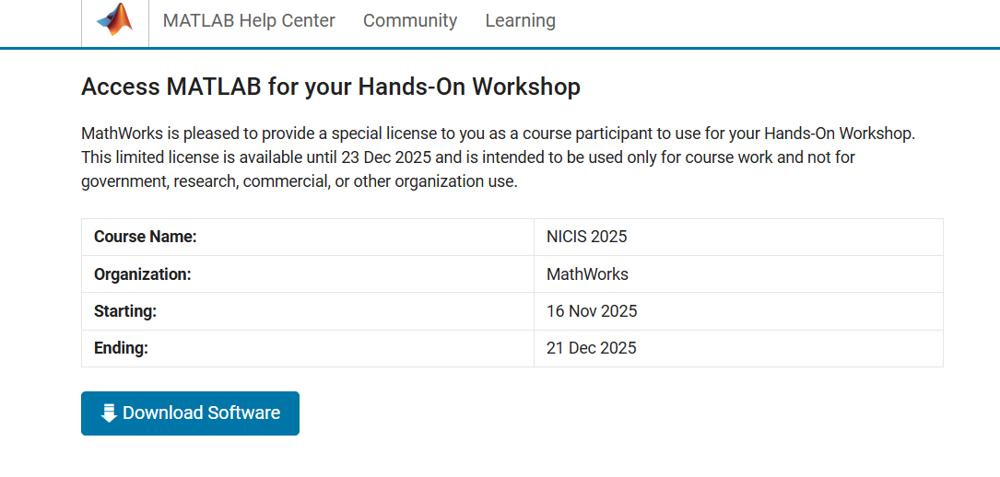
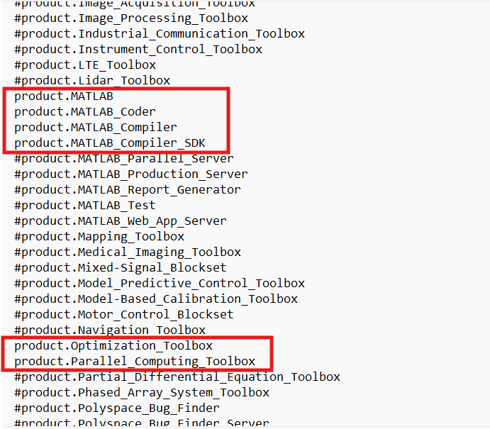

MATLAB
======

[MATLAB](https://www.mathworks.com/products/matlab.html) _(**MAT**rix **LAB**oratory)_ is a proprietary multi-paradigm programming language and numeric computing environment developed by [MathWorks](https://www.mathworks.com/). MATLAB allows matrix manipulations, plotting of functions and data, implementation of algorithms, creation of user interfaces, and interfacing with programs written in other languages.

This project forms part of the CHPC Student Cluster competition, where participants will apply Parallel computing techniques in the MATLAB environment to speed up their code execution. This problem has been put forward as part of a collaboration between MathWorks, Opti-Num Solutions and the CHPC.


# Challenge 

Given a large batch of customer loan applications, implement a decision engine that determines loan eligibility for each application according to the provided business rules. Participants must optimize and parallelize the baseline MATLAB implementation to maximize throughput (decisions per second) on their cluster

Optimize and parallelize the following funtion to maximise the throughput  
```
decideLoanEligibility_serial()
```

Run a benchmark test for your optimized function by running the following function
```
runBaselineBenchmark(1e5)
```
1e5 is the number of customer loan applications to be processed. This is a baseline amount, this can be set to a higher number for further testing.

## Additional Information

### Loan Eligibility
The loan eligibility criteria is already included in the code and should not be modified. This section serves to provide context on the criteria

The algorithm will reject any application if:
- Age < 21 or Age > 75 (reason code: AGE)
- Credit Score < 650 (CREDIT)
- Number of Defaults > 0 (DEFAULT)
- Employment Years < 1 (EMPLOYMENT)
- Annual Income < 20,000 (INCOME)
- Debt To Income Ratio = Existing Debt / Annual Income > 0.40 (DTI)
- Requested Loan Amount > 4 × Annual Income (REQUEST_SIZE)

If none of the above rules reject the application, compute a risk score and accept only if score <= risk threshold:
- Risk Score = weighted sum of normalized features (higher means riskier).
- Accept if Risk Score <= 0.5; otherwise reject with reason code RISK_HIGH.
- If accepted, use reason code APPROVED.

# Installation Instructions

Team Captains have been provided with the URL, Activation Key and Licensing information required to download, install and activate their MATLAB deployments.

1. Use the link provided to navigate to the MATLAB CHPC Workshop Workspace:
   <p align="center"></p>

1. You will be prompted to login or create a MathWorks account. Please do so in order to link your account with the provided license.

1. You DO NOT need to download the installer here as you will be using MATLAB Product Manager to do the installation on your head node.

1. Install all of the [dependencies](https://github.com/mathworks-ref-arch/container-images/blob/main/matlab-deps/r2024b/ubuntu24.04/base-dependencies.txt) required to run the MATLAB installer:
   * DNF / YUM
     ```bash
     # RHEL, Rocky, Alma, CentOS Stream
     sudo dnf install alsa-lib.x86_64 cairo.x86_64 cairo-gobject.x86_64 cups-libs.x86_64 gdk-pixbuf2.x86_64 glib2.x86_64 glibc.x86_64 glibc-langpack-en.x86_64 glibc-locale-source.x86_64 gtk3.x86_64 libICE.x86_64 libXcomposite.x86_64 libXcursor.x86_64 libXdamage.x86_64 libXfixes.x86_64 libXft.x86_64 libXinerama.x86_64 libXrandr.x86_64 libXt.x86_64 libXtst.x86_64 libXxf86vm.x86_64 libcap.x86_64 libdrm.x86_64 libglvnd-glx.x86_64 libsndfile.x86_64 libtool-ltdl.x86_64 libuuid.x86_64 libwayland-client.x86_64 make.x86_64 mesa-libgbm.x86_64 net-tools.x86_64 nspr.x86_64 nss.x86_64 nss-util.x86_64 pam.x86_64 pango.x86_64 procps-ng.x86_64 sudo.x86_64 unzip.x86_64 which.x86_64 zlib.x86_64
     ```
   * APT
     ```bash
     # Debian, Ubuntu
     sudo apt install libasound2t64 libcairo2 libcairo-gobject2 libcups2 libgdk-pixbuf-2.0-0 libglib2.0-0 libc6 locales libgtk-3-0 libice6 libxcomposite1 libxcursor1 libxdamage1 libxfixes3 libxft2 libxinerama1 libxrandr2 libxt6 libxtst6 libxxf86vm1 libcap2 libdrm2 libgl1 libsndfile1 libltdl7 libuuid1 libwayland-client0 libgbm1 net-tools libnspr4 libnss3 libpam0g libpango-1.0-0 procps sudo unzip which zlib1g
     ```
   * Pacman
     ```bash
     # Arch
     sudo pacman -S alsa-lib cairo cups gdk-pixbuf2 glib2 glibc glibc-locales gtk3 libice libxcomposite libxcursor libxdamage libxfixes libxft libxinerama libxrandr libxt libxtst libxxf86vm libcap libdrm libglvnd libsndfile libtool make mesa-utils net-tools nspr nss pam pango procps-ng sudo unzip which zlib
     ```
1. X11 Forwarding needs to be configured and enabled on both the client and the server side:
   On your **head node**
   * Enable `X11Forwarding`, by editing `/etc/ssh/sshd_conf` and setting the following option:
     ```conf
     ...
     X11Forwarding yes
     ...
     ```
   * Install `xauth`
     * DNF / YUM
     ```bash
     # RHEL, Rocky, Alma, CentOS Stream
     sudo dnf update -y
     sudo dnf install xauth
     ```
     * APT
     ```bash
     # Debian, Ubuntu
     sudo apt update
     sudo apt install xauth
     ```
     * Pacman
     ```bash
     # Arch
     sudo pacman -Syu
     sudo pacman -S xorg-xauth
     ```
   * Reload your SSH server configuration
     ```bash
     sudo systemctl reload sshd
     ```
1. Open a new terminal on your local workstation and `ssh` onto your head node with the following option(s):
   ```bash
   # The -X switch enables the option ForwardX11
   ssh -X -i <PATH-TO-KEY> <USER>@<HEADNODE_IP>
   ```

> [!WARNING]
> Should you have issues with how the MATLAB GUI is rendered on your local workstation or receive a number of errors, you can try remedy these by enabling the `ForwardX11Trusted` option `-Y` switch, which will prevent your `ssh` connection from being subjected to [X11 Security Extensions](https://www.x.org/wiki/Development/Documentation/Security/).

## Install MATLAB, Simulink and Associated Toolboxes

1. On your **head node**, from a new terminal, use wget to download the latest version of mpm.
   ```
   wget https://www.mathworks.com/mpm/glnxa64/mpm
   ```
1. Give executable permissions to the downloaded file so that you can run mpm.
   ```
   chmod +x mpm
   ```
1. Install products and support packages for the latest MATLAB release by specifying installation options in an input file.
1. From the [mpm-input-files](https://github.com/mathworks-ref-arch/matlab-dockerfile/tree/main/mpm-input-files/R2025b) folder, download a copy of the mpm_input_r2025b.txt file.
1. In the downloaded file, configure the MATLAB installation by uncommenting lines that start with a single # for the following products:
   * MATLAB
   * MATLAB Coder
   * MATLAB Compiler
   * MATLAB Compiler SDK
   * Optimization Toolbox
   * Parallel Computing Toolbox
   * Statistics and Machine Learning Toolbox
   <p align="center"></p>
1. Save the file

1. Install the products and support package using mpm install. Specify the full path to the input file you downloaded and updated.

   ```
   ./mpm install --inputfile=/path/to/file/mpm_input_r2025b.txt
   ```
You have successfully installed MATLAB!

> [!WARNING]
> You are **STRONGLY** advised to install your MATLAB installations to a local, non-shared location. This will ensure that the License is correctly installed and configured for each the nodes in your cluster.

## Activate your license

1. The activation client is typically located here:
   ```
   /usr/local/MATLAB/R20XXy/bin/glnxa64/MathWorksProductAuthorizer.sh
   ```
Once you have launched the MathWorks activation client:
1. Log into your MathWorks account
2. Select the license provided to you from the list of licenses you would like to activate
3. Confirm the activation information
4. Click "finish" to complete the activation process.

   > [WARNING]
   > For the license to appear in your MATLAB account, one may need to link the license to your account.
   > This can be done on: https://www.mathworks.com/licensecenter

## Running MATLAB
There are multiple ways to launch the run. If graphics port over SSH without immense delays, one can use the MATLAB GUI. If porting graphics proves to be troublesome, you can launch a job non-interactively using command line.


### Running the Benchmark via GUI
```bash
./<PATH_TO_MATLAB/bin/glnxa64/MATLAB>
```

Once the GUI opens,
```MATLAB
cd <PATH_TO_MATLAB_SCRIPTS>
runBaselineBenchmark(1e5)
```
### Running the Benchmark via Command Line
To execute the MATLAB benchmark script on a Linux node without launching the GUI, use the following command structure.
Replace `<MATLAB_BINARY_PATH>` with the path to your MATLAB executable and `<PATH_TO_SCRIPTS>` with the directory containing `runBaselineBenchmark.m`.

```bash
<MATLAB_BINARY_PATH> -nodisplay -nosplash -batch "cd('<PATH_TO_SCRIPTS>'); runBaselineBenchmark(<SIZE>);"
```
Obtain a basline run for reference for your cluster using a problem size of 1e5.

## Optimising MATLAB
Your task is to optimise `runBaselineBenchmark.m` function on a *single node*. The serial decision engine runs on a single thread presently.
Parallelize this code to run across multiple threads.

## Deliverables

Teams are required to submit their optimized source code and a log of their highest performing run. Participants are encouraged to experiment with different problem sizes to saturate their cluster's resources and achieve the highest possible throughput.

| Item | Description | Scoring Criteria |
| :--- | :--- | :--- |
| **Source Code** | All modified `.m` files required to run your solution. | Code must execute without errors. |
| **Run Log** | The console output from your best run demonstrating the achieved throughput. | **10%** - Ranked by highest **Decisions/Second**. |

### Required Output Format
All submissions (Run Logs) must strictly follow the format below. The `Throughput` value will be used for grading.

```text
Generating [PROBLEM SIZE] customer records...
Running baseline serial decision engine...
Elapsed: 1.670 s, Throughput: 59862.7 decisions/s, Accepted: 4101 (4.10%)
```

## Bonus Challenge: Distributed Computing

While the main challenge focuses on vertical scaling (optimizing performance on a single node), high-performance computing ultimately relies on horizontal scaling (distributing the workload across multiple nodes). 

For the bonus challenge, teams must configure their cluster to allow MATLAB to offload computations from the Head Node to the Compute Nodes using **MATLAB Parallel Server**.

### Requirements
To achieve this, you must set up the following architecture:

1.  **Head Node:** Must have **MATLAB Parallel Server** and **Parallel Computing Toolbox** installed.
2.  **Compute Nodes:** Must have a valid MATLAB installation locally on each node (matching the version on the head node).
3.  **Network:** Passwordless SSH must be configured between the head node and all compute nodes to allow the scheduler to launch jobs.

### Instructions

1.  **Compute Node Installation:**
    Repeat the installation steps provided in the "Installation Instructions" section for **each** of your compute nodes. Ensure the installation paths are identical across all nodes.

2.  **Parallel Server Setup:**
    On the **Head Node**, ensure the **MATLAB Parallel Server** product is installed (via `mpm`).

3.  **Cluster Profile Configuration:**
    You must configure a Cluster Profile in MATLAB that integrates with your workload manager (e.g., Slurm) or uses the MATLAB Job Scheduler.
    * Open MATLAB on the head node.
    * Navigate to **Home > Parallel > Create and Manage Cluster Profiles**.
    * Create a profile that defines how MATLAB submits jobs to your cluster's scheduler.

### The Objective
Modify your optimized solution to initialize a parallel pool (`parpool`) that spans **multiple nodes** (not just multiple cores on one node).
* Demonstrate that your code allows the Head Node to distribute chunks of the customer data to workers running on the Compute Nodes.
* Record the throughput when running on 2 or more nodes.

