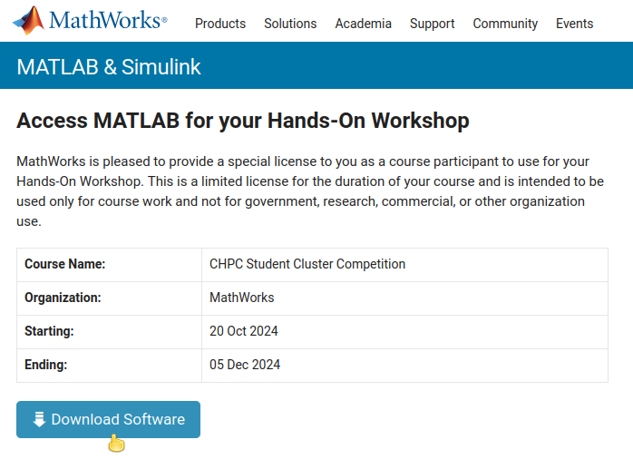
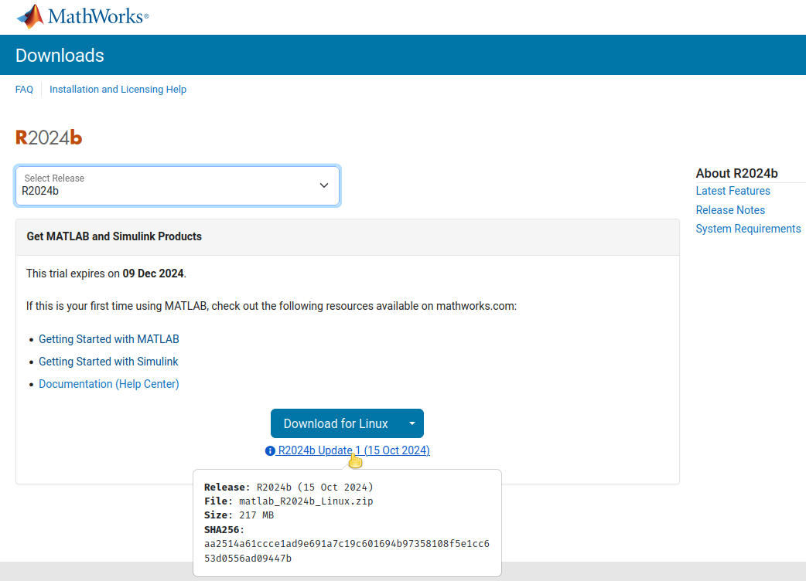
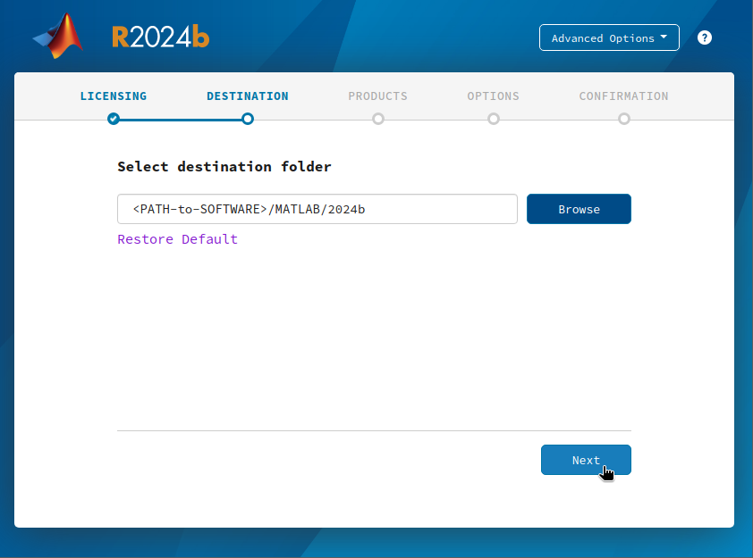
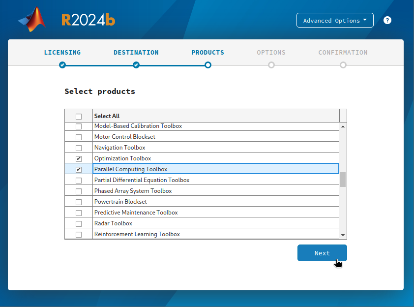
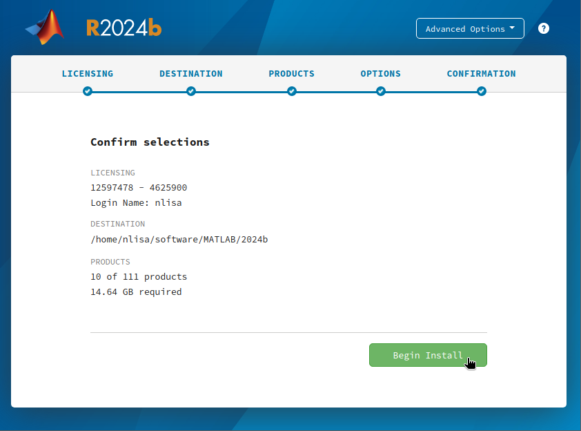
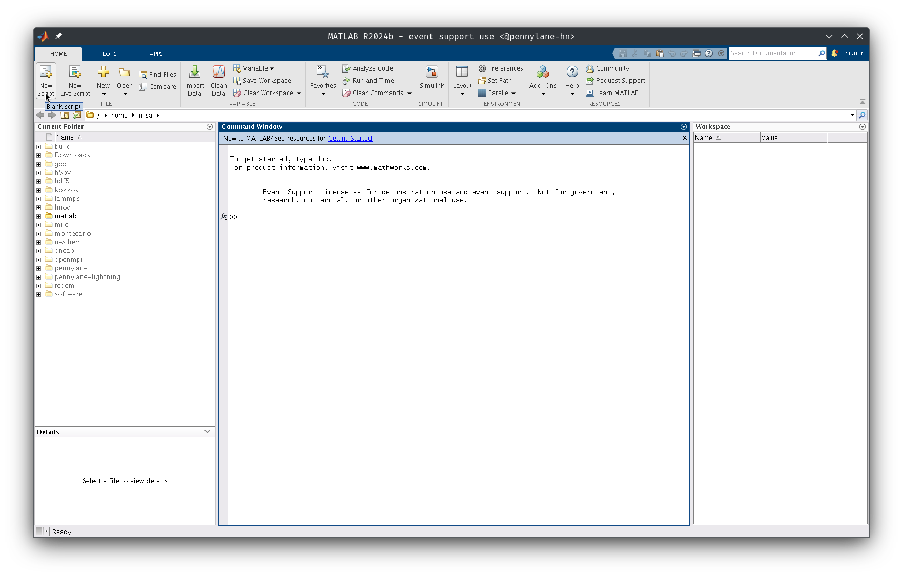
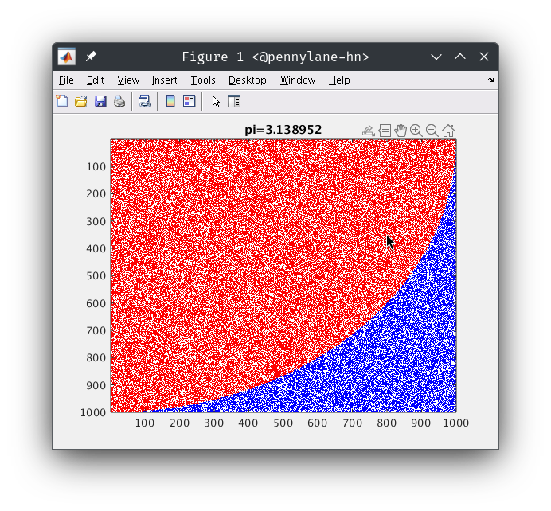
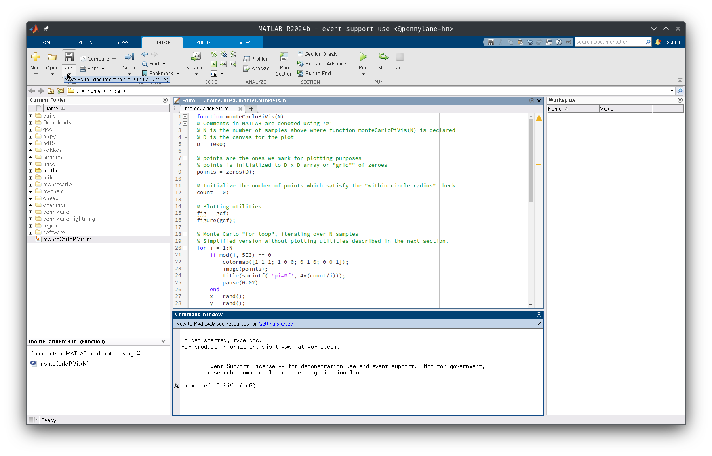

MATLAB
======

[MATLAB](https://www.mathworks.com/products/matlab.html) _(**MAT**rix **LAB**oratory)_ is a proprietary multi-paradigm programming language and numeric computing environment developed by [MathWorks](https://www.mathworks.com/). MATLAB allows matrix manipulations, plotting of functions and data, implementation of algorithms, creation of user interfaces, and interfacing with programs written in other languages.

This project forms part of the CHPC Student Cluster competition, where participants will apply Parallel computing techniques in the MATLAB environment to speed up their code execution. This problem has been put forward as part of a collaboration between MathWorks, Opti-Num Solutions and the CHPC.

# Installation Instructions

Team Captains have been provided with the URL, Activation Key and Licensing information required to download, install and activate their MATLAB deployments.

1. Use the link provided to navigate to the MATLAB CHPC Workshop Workspace:
   <p align="center"></p>

1. Download the 2024B Installation files for Linux:
   <p align="center"></p>

1. Copy the files over to your cluster:
   * You can use either [WireGuard](https://github.com/chpc-tech-eval/scc/tree/main/tutorial2#wirguard-vpn-cluster-access) or [ZeroTier](https://github.com/chpc-tech-eval/scc/tree/main/tutorial2#zerotier) as described in the Selection Round content.
   * Alternatively you can use `scp` to transfer the files over `SSH`:
     ```bash
     scp -i <PATH-TO-SSH-KEY> <PATH-TO-MATLAB>/matlab_R2024b_Linux.zip <USER>@<DESTINATION_IP>:<DESTINATION_PATH>
     ```
1. From your **head node** server, `unzip` the MATLAB `.zip` file:
   ```bash
   mkdir <DEST_DIR>

   # Ensure that you system has an appropriate package install to run the unzip program of similar.
   unzip matlab_R2024b_Linux.zip -d <DEST_DIR>
   ```
1. Install all of the [dependencies](https://github.com/mathworks-ref-arch/container-images/blob/main/matlab-deps/r2024b/ubuntu24.04/base-dependencies.txt) required to run the MATLAB installer:
   * DNF / YUM
     ```bash
     # RHEL, Rocky, Alma, CentOS Stream
     sudo dnf install alsa-lib.x86_64 cairo.x86_64 cairo-gobject.x86_64 cups-libs.x86_64 gdk-pixbuf2.x86_64 glib2.x86_64 glibc.x86_64 glibc-langpack-en.x86_64 glibc-locale-source.x86_64 gtk3.x86_64 libICE.x86_64 libXcomposite.x86_64 libXcursor.x86_64 libXdamage.x86_64 libXfixes.x86_64 libXft.x86_64 libXinerama.x86_64 libXrandr.x86_64 libXt.x86_64 libXtst.x86_64 libXxf86vm.x86_64 libcap.x86_64 libdrm.x86_64 libglvnd-glx.x86_64 libsndfile.x86_64 libtool-ltdl.x86_64 libuuid.x86_64 libwayland-client.x86_64 make.x86_64 mesa-libgbm.x86_64 net-tools.x86_64 nspr.x86_64 nss.x86_64 nss-util.x86_64 pam.x86_64 pango.x86_64 procps-ng.x86_64 sudo.x86_64 unzip.x86_64 which.x86_64 zlib.x86_64
     ```
   * APT
     ```bash
     # Debian, Ubuntu
     sudo apt install libasound2t64 libcairo2 libcairo-gobject2 libcups2 libgdk-pixbuf-2.0-0 libglib2.0-0 libc6 language-pack-en locales libgtk-3-0 libice6 libxcomposite1 libxcursor1 libxdamage1 libxfixes3 libxft2 libxinerama1 libxrandr2 libxt6 libxtst6 libxxf86vm1 libcap2 libdrm2 libgl1 libsndfile1 libltdl7 libuuid1 libwayland-client0 libgbm1 net-tools libnspr4 libnss3 libpam0g libpango-1.0-0 procps sudo unzip which zlib1g
     ```
   * Pacman
     ```bash
     # Arch
     sudo pacman -S alsa-lib cairo cups gdk-pixbuf2 glib2 glibc glibc-locales gtk3 libice libxcomposite libxcursor libxdamage libxfixes libxft libxinerama libxrandr libxt libxtst libxxf86vm libcap libdrm libglvnd libsndfile libtool make mesa-utils net-tools nspr nss pam pango procps-ng sudo unzip which zlib
     ```
1. X11 Forwarding needs to be configured and enabled on both the client and the server side:
   On your **head node**
   * Enable `X11Forwarding`, by editing `/etc/ssh/sshd_conf` and setting the following option:
     ```conf
     ...
     X11Forwarding yes
     ...
     ```
   * Install `xauth`
     * DNF / YUM
     ```bash
     # RHEL, Rocky, Alma, CentOS Stream
     sudo dnf update -y
     sudo dnf install xauth
     ```
     * APT
     ```bash
     # Debian, Ubuntu
     sudo apt update
     sudo apt install xauth
     ```
     * Pacman
     ```bash
     # Arch
     sudo pacman -Syu
     sudo pacman -S xorg-xauth
     ```
   * Reload your SSH server configuration
     ```bash
     sudo systemctl reload sshd
     ```
1. Open a new terminal on your local workstation and `ssh` onto your head node with the following option(s):
   ```bash
   # The -X switch enables the option ForwardX11
   ssh -X -i <PATH-TO-KEY> <USER>@<HEADNODE_IP>
   ```

> [!WARNING]
> Should you have issues with how the MATLAB GUI is rendered on your local workstation or receive a number of errors, you can try remedy these by enabling the `ForwardX11Trusted` option `-Y` switch, which will prevent your `ssh` connection from being subjected to [X11 Security Extensions](https://www.x.org/wiki/Development/Documentation/Security/).

## Install MATLAB, Simulink and Associated Toolboxes

1. On your **head node** navigate to the folder where you'd `unzipped` the downloaded MATLAB files and run the installer:
   ```bash
   cd <PATH_TO_MATBAL>
   ./install
   ```
1. This will open the MATLAB installation GUI on your local machine.
   Enter your `<EMAIL>` and `<PASSWORD>` associated with the Competition:
   <p align="center"></p>
1. Select the license associated with CHPC Workshop:
   <p align="center"></p>
1. Select an installation directory:
   <p align="center"></p>
1. Select the products necessary to run the benchmarks.
   The license that you've been provided with grants you access to the full suite of MATLAB products. You are free to experiment with these until the conclusion of the competition. For the purposes of the competition you will require the following at the very least
   * MATLAB
   * MATLAB Coder
   * MATLAB Compiler
   * MATLAB Compiler SDK
   * Optimization Toolbox
   * Parallel Computing Toolbox
   <p align="center"></p>
1. Confirm your configuration settings and install.
   The difference between the curated selection of toolboxes above and selection of the entire available suite of tools, is approximately 4 GB downloads (10 GB installed). Should have difficulties with missing libraries consider installing ***everything***.
   <p align="center"></p>
1. Export the `<PATH_TO_MATLAB>` so that it is included as part of your `<PATH>` variable:
   ```bash
   export PATH=<PATH_TO_SOFTWARE_DIR>:$PATH
   ```
1. You can now instantiate the MATLAB GUI and interpreter using
   ```bash
   matlab
   ```
   <p align="center"></p>

You have successfully installed MATLAB!

> [!WARNING]
> You are **STRONGLY** advised to install your MATLAB installations to a local, non-shared location. This will ensure that the License is correctly installed and configured for each the nodes in your cluster.

# Benchmark: Monte Carlo Sampling Simulation (Calculating PI)

Your task is to optimize and parallelize MATLAB code for improved execution speed of a Monte Carlo simulation used to estimate the value of Pi in MATLAB. For approximating the value of Pi consider this stochastic method that populates an array with random values and tests for unit circle inclusion, i.e. we generate a random number along the coordinate $x \in [0, R]$ and another random number along the coordinate $y \in [0, R]$. The ratio of the area of the circle of radius $R$, relative to that of the square of side with length $2R$, can be written as follows:

<p align="center">
$\frac{\textnormal{area of circle}}{\text{area of square}} = \frac{\pi r^2}{4r^2} = \frac{\pi}{4}$
</p>

## Visualize Problem Statement

In order to better understand the task at hand, save the following MATLAB script to `monteCarloPiVis.m`. This script will randomly generate a pair of $(x, y)$ points on a rectangular grid and test whether the radius $r^2 = x^2 + y^2$ of those randomly generated points lies within the circumference of a circle. The value of $\pi$ is approximately proportional to the ratio of points within the circle versus those that lie outside of it. The accuracy of this approximation can be improved by increasing the number of random samples.

<p align="center"></p>

For now carefully copy and paste the code as it is for now for the purposes of plotting and demonstrating the example. Read through the comments to help you further understand exactly what it is that you are coding. Further descriptions will be given in the next section.

```matlab
function monteCarloPiVis(N)
  % Comments in MATLAB are denoted using '%'
  % N is the number of samples above where function monteCarloPiVis(N) is declared
  % D is the canvas for the plot
  D = 1000;

  % points are the ones we mark for plotting purposes
  % points is initialized to D x D array or "grid"" of zeroes
  points = zeros(D);

  % Initialize the number of points which satisfy the "within circle radius" check
  count = 0;

  % Plotting utilities
  fig = gcf;
  figure(gcf);

  % Monte Carlo "for loop", iterating over N samples
  % Simplified version without plotting utilities described in the next section.
  for i = 1:N
    if mod( i, 5e3 ) == 0
        colormap( [1 1 1; 1 0 0; 0 1 0; 0 0 1] );
        image( points );
        title( sprintf( 'pi=%f', 4*(count/i)) );
        pause( 0.02 )
    end
    x = rand();
    y = rand();
    r = sqrt(x^2 + y^2);
    if r <= 1.0
        points( round(x*(D-1))+1, round(y*(D-1)+1)) = 2;
        count = count + 1;
    else
        points( round(x*(D-1))+1, round(y*(D-1)+1)) = 4;
    end
  end
end
```

In order for your to reproduce the graph above, from the MATLAB GUI click on the "New Script" button copy, paste (using `Ctrl+Y`) and save the above into the "untitled" window. Then run your `monteCarloPiVis(1e6)` script with `N=1 000 000`.
<p align="center"></p>

## Single Core (Serial) Experiment

Save the following MATLAB script as `monteCarloPi.m` and use it to run the experiment on a Single Core. Verify the number of core(s) used to run the task using a terminal multiplexer together with your choice of either `htop` or `btop`, following the instructions from the [Selection Round: On Terminal Multiplexers and Basic System Monitoring](https://github.com/chpc-tech-eval/scc/tree/main/tutorial2#terminal-multiplexers-and-basic-system-monitoring) content.

```matlab
function monteCarloPi(N)
  % N is number of samples
  % tic is used to start a timer
  % toc is use to measure time taken to run benchmark

  tic
  count = 0;
  for i=1:N
    x = rand();
    y = rand();
    r = sqrt(x^2 + y^2);
    if r < 1
        count = count + 1;
    end
  end
  estimatePi = 4*count/N;
  timeTaken = toc;

  fprintf("Estimate for pi is %.8f after %f seconds\n", estimatePi, timeTaken)
  fprintf("Absolute error is %8.3e\n", abs( estimatePi-pi ))
end

```

This time you will be running the benchmark without the GUI in a non-interactive mode using:
```bash
matlab -batch "monteCarloPi(1e8)"

# If you are running a version of MATLAB older than R2019b or experience difficulties executing the above,
# use the following to run the MATLAB script and immediately exit the intepreter
matlab -nodisplay -nosplash -nodesktop -nojvm -r "run(monteCarloPi(1e6).m');exit;"
```

> [!TIP]
> Use a sensible number like $10^8$ for initial experimentation and testing.

## Performance Improvements

You will now be parallelizing, improving and enhancing your simulation using the following steps.

### Replace the `for` loop statement with the parallel `parfor` loop statement:

Further information can be found for `parfor` as well as additional information can be found here:
* [MATLAB Par-For Documentation](https://www.mathworks.com/help/parallel-computing/parfor.html),
* [Algorithm Acceleration Using Parallel for-Loops (parfor)](https://www.mathworks.com/help/coder/ug/acceleration-of-matlab-algorithms-using-parallel-for-loops-parfor.html) and
* [Generate Parallel for-Loops Using the Open Multiprocessing (OpenMP) Application Interface](https://www.mathworks.com/help/ecoder/ug/Speed-Up-for-loop-implementation-in-the-Code-Generated-using-parfor.html).

Essentially the variable `M` represents the number of OpenMP threads to parallelize the experiment over. Typically this will *match* the number of cores you have per node. Observe the number of cores utilized using `btop` or `htop`.

```Matlab
function monteCarloPi_parfor( N, M )
  tic
  ticBytes(gcp)
  % Maximum number of workers (threads) running in parallel
  % Use M=0 for serial, single core run
  M = <NUM_CORES>
  count = 0;
  parfor( i=1:N, M )
    x = rand();
    y = rand();
    r = sqrt(x^2 + y^2);
    if r < 1
        count = count + 1;
    end
  end
  estimatePi = 4*count/N;
  timeTaken = toc;
  dataTransfered = tocBytes(gcp);

  fprintf("Estimate for pi is %.8f after %f seconds with %f Bytes transfered between worker nodes\n", estimatePi, timeTaken, dataTransfered)
  fprintf("Absolute error is %8.3e\n", abs( estimatePi-pi ))
end

```

### Experiment with preallocation as well as a vectorized implementation

This solution will eliminate the for-loop altogether and make use of MATLAB optimized matrix operations.

There are also a number of random number generator algorithms for you to experiment with [Random Number Streams](https://www.mathworks.com/help/matlab/math/creating-and-controlling-a-random-number-stream.html).

```MATLAB
function monteCarloPi_vectorized( N )
  tic;
  count = 0;

  % Example Random Number Generator Stream using SIMD Mersenne Twister Algorithm
  % Make sure you test other algorithms, i.e.
  xyStream = RandStream('dsfmt19937')
  xy = rand(xystream,N,2);
  count = sum( sum( xy.^2, 2 ) <= 1 );
  piEst = 4*count/N;
  timeTaken = toc;

  fprintf("Estimate for pi is %.8f after %f seconds using %f Bytes\n",piEst, timeTaken)
  fprintf("Absolute error is %8.3e\n",abs(piEst2-pi))
  fprintf("%.2f million samples per second\n", N/timeTaken/1e6)

end

```
The creation of an `N x 2` array `xy` if known as [Preallocation](https://www.mathworks.com/help/matlab/matlab_prog/preallocating-arrays.html). Where the relevant parts of the algorithm can be broken down as follows:

* Instead of individually instantiating the `rand()` function and assigning the scalars `x` and `y`, generate an array of dimension `N x 2`.
```math
  xy_{N\times 2} =
  \left[ {\begin{array}{cc}
    x_{1} & y_{1}\\
    x_{2} & y_{2}\\
    \vdots & \vdots\\
    x_{N} & y_{N}\\
  \end{array} } \right]

```
* Moreover the element-wise square operation of the array `xy.^2` is the first part to be evaluated and is equivalent to:
```math
xy.^2 =
  \left[ {\begin{array}{cc}
    x_{1}^2 & y_{1}^2\\
    x_{2}^2 & y_{2}^2\\
    \vdots & \vdots\\
    x_{N}^2 & y_{N}^2\\
  \end{array} } \right]
```

* Next there is a pair-wise inner summation which is tested to lie within a unit circle, i.e. `sum(xy.^2, 2) <= 1`:
```math
 =
  \left[ {\begin{array}{cc}
    (x_{1}^2 + y_{1}^2) & \le 1\\
    (x_{2}^2 + y_{2}^2) & \le 1\\
    \vdots & \vdots\\
    (x_{N}^2 + y_{N}^2) & \le 1\\
  \end{array} } \right]
```
* This results in an `N x 1` column array of `true` or `false` conditionals each time the condition $x_{i}^2 + y_{i}^2 \le 1$ is satisfied or not.

* Lastly, the outer summation counts the number of occurrences for which the above conditional test is `true`, i.e. sum all the ones`[1]` in the `N x 1` column array.

## Run the Benchmark over your cluster

To assist you in running across your clusters, you will be making use of the MATLAB C Compiler to produce and object file or executable binary.
```bash
mcc -m <your>monteCarloPi.m
```
This will produce an executable binary which can be run directly from your shell:
```bash
./<your>monteCarloPi
```

As well as a shell script named `run_<your>monteCarloPi.sh`, which is used to configure the interpreter's runtime environment, which will assist you in running your script using `mpirun`. An example script is provided in `run_EXAMPLE_COMPILED.sh`

Now you will attempt to run the benchmark with $N = 10^{10}$ samples. Observe the failure mode and use the random number generator within chunks of the `parfor` loop, optionally within a [Controlled Stream](https://www.mathworks.com/help/parallel-computing/repeat-random-numbers-in-parfor-loops.html).

There are also a number of options for [initializing](https://www.mathworks.com/help/parallel-computing/parpool.html) the `parallel` pool across the cluster.

```MATLAB
function monteCarloPi_parallel( N, M, numChunks )
  arguments
  % Configure default arguments
    N = 1e10;
    M = <MAX_WORKERS>;
    numChunks = 1e2;
  end

  tic;

  piEst = 0

  % Configure Parallel Computing environment
  % parpool can take on values of `local`, `Threads`, `Processes`
  % Experiment with these to determine the best results

  %%%%%%%%%%%%%%%%%%%%%%%%%%
  %
  % Optimize the Code below
  %
  %%%%%%%%%%%%%%%%%%%%%%%%%%

  mpiSettings = parcluster('local');
  mpiSettings.NumWorkers = M;
  saveProfile(mpiSettings);
  pool = parpool('local', M);

  xyStream = RandStream('Threefry');

  parfor( i=1:numChunks, M )
    count = 0;
    xy = rand(xyStream, N/numChunks, 2);
    count = sum( sum( xy.^2, 2 ) <=1 );
    piEst = piEst + 4*count/(N/numChunks);
  end

  timeTaken = toc;
  fprintf("Estimate for pi is %.8f after %f seconds using %f Bytes\n",piEst, timeTaken)
  fprintf("Absolute error is %8.3e\n",abs(piEst-pi))
  fprintf("%.2f million samples per second\n", N/timeTaken/1e6)

  delete(pool);
end

```

## Submission

You must use the `monteCarloPi_parallel` MATLAB script above as a starting point to accurately calculating $\pi$ over your cluster. Clearly document and describe the changes that you have implemented. Run the script on your most powerful node, and draw a table where you indicate how the number of samples changes with a change in the 'Maximum Number of Workers' and the 'Number of Chunks'.

After completing the above experiments, you may attempt to optimize and run the benchmark across multiple nodes using MPI.

```bash
mpirun -np <N> --hostfile <PATH_TO_HOSTFILE> run_monteCarloPi_parallel.sh <PATH_TO_MATLAB_INSTALLATION>
```

Submit your final script, your compiled binaries and your results. See if you can run the experiment for $10^12$ samples on your cluster. You will be scored on the:
* accuracy of your estimation of %\pi%,
* maximum number of samples you've managed to complete the experiment with *(higher is better),* and
* rate of calculating samples.

> [!TIP]
> If you are interested in improving your results even further, consider exploring and replacing the Parallel For-Loop with [SPMD](https://www.mathworks.com/help/parallel-computing/spmd.html?searchHighlight=spmd&s_tid=srchtitle_support_results_1_spmd) statements.
>
> You can also explore running the [HPC Challenge](https://www.mathworks.com/help/parallel-computing/benchmark-your-cluster-with-the-hpc-challenge.html) directly from within MATLAB.


